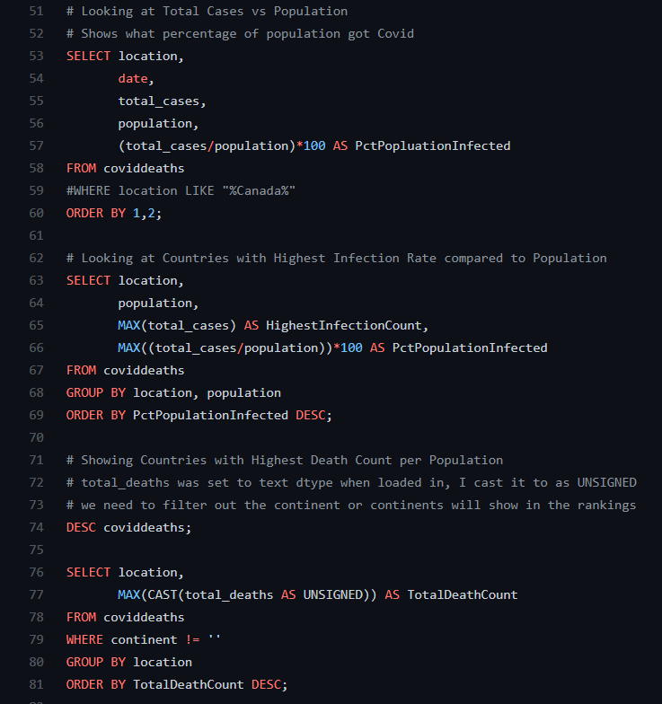

# COVID-19 SQL Data Exploration Project

# Preface

[Dataset](https://ourworldindata.org/covid-deaths) 

Data pulled on July 6th 2021

This README documents about the project, skills used, and future plans for development. Please checkout my [COVID-19 Tableau Dashboard Project](https://github.com/AspiringDSer/COVID19_Tableau_Dashboard). I also used [SQL queries](https://github.com/AspiringDSer/COVID19_Tableau_Dashboard/blob/master/COVID19_data_for_tableau_dashboard.sql) to create tables to connect with Tableau.

# About the Project

[Full List of Exploration SQL Queries](https://github.com/AspiringDSer/COVID19-SQL-Data-Exploration-Project/blob/master/COVID19_Data_Exploration.sql)

This portfolio piece is to demonstrate some of my SQL skills. I created SQL queries to explore the COVID-19 Dataset. 

Some Exploration Queries:
* Total Cases vs Total Deaths
* Total Cases vs Population
* Countries with Highest Infection Rate compared to Population
* Countries with Highest Death Count per Population 

**Skills Used:**
* Joins
* CTE's 
* Temp Tables 
* Window Functions
* Aggregate Functions
* Creating Views 
* Converting Data Types 

I preprocessed the original dataset, `owid-covid-data.csv`,  then split it into two csv files:

    Preprocess -> cleaned_owid_covid_data.csv 

    Split -> CovidDeaths.csv + CovidVaccinations.csv 

## Files:
* images/sql_query_snippet.PNG --- Snippet of SQL Queries 

* COVID19_Data_Exploration.sql --- Data Exploration on the COVID-19 Dataset

* CovidDeaths.csv --- Data on COVID-19 Deaths

* CovidVaccinations.csv --- Data on COVID-19 Vaccinations        

* cleaned_owid_covid.csv --- CSV file of cleaned columns of the original dataset. I used Python for cleaning. 

* owid-covid-data.csv --- Original Dataset 

* owid_covid_data_preprocessing.ipynb --- Jupyter Notebook that explains the data preprocessing on the original dataset via Python
* CHANGELOG&#46;md --- All notable changes to this project will be documented in this file. 

# Future Developments
* Add more Window Function Queries 
* Deeper Dive into Dataset 

